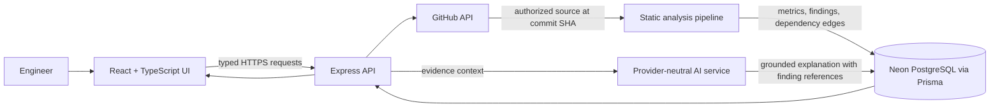

# Logicloom architecture

## What exists today

This repository contains a React/Vite frontend and a separately runnable Express API. The backend is an early prototype:

- `src/App.tsx` owns the navigation and most page UI.
- `src/data.ts` contains the sample files, issues, graph nodes, and demo history used by the UI.
- `src/services/mockAnalysis.ts` holds sample metrics, a deterministic impact estimate, and a fixed example explanation.
- `src/components/LoginScreen.tsx` is a local demo entry screen. It is not backed by user accounts.
- `backend/src/server.ts` exposes the API; `backend/src/github/client.ts` accesses GitHub server-side; `backend/src/analyzers/` contains deterministic source heuristics.
- `backend/prisma/schema.prisma` defines PostgreSQL snapshot persistence. Set `DATABASE_URL` and run `npm run db:push` before repository connection or analysis.
- `POST /api/ai/insights` is optional and requires a configured OpenAI-compatible endpoint and server-side key.

Treat the existing workspace screens as **illustrative demo data** unless a feature specifically displays API-backed results. Live analysis is limited to bounded JavaScript/TypeScript source and heuristic rules. The demo login is not real authentication. The API has no user/tenant authorization and must not be exposed publicly as-is.

## Recommended architecture

Keep a single repository with two independently runnable applications. Do not move or rewrite the existing UI just to match the proposed folders: introduce these boundaries as the corresponding features are implemented.

```text
logicloom/
  src/
    App.tsx            # application shell and illustrative sample screens
    components/        # login and live repository analysis panel
    services/          # typed HTTP client and illustrative sample metrics
  backend/
    src/
      routes.ts        # HTTP paths, request validation, and analysis job
      github/          # GitHub API client and repository/branch access
      analyzers/       # deterministic source heuristics
      db.ts            # Prisma client lifecycle
      config.ts        # environment validation
    prisma/
      schema.prisma
  docs/
    architecture.md
```

**First implementation step:** keep the current app under `src/` while the HTTP API is introduced. Once real pages use typed API responses, split `App.tsx` into feature components incrementally. A folder structure alone does not make the system modular.

### Frontend

The frontend presents repository and analysis data; it does not clone repositories, calculate authoritative risk, call GitHub with a user token, or call an LLM directly. Feature screens call typed services, which call the backend. Loading, empty, success, and error states belong at each feature boundary. Monaco receives a file's source and location-aware findings from the API.

### Backend and analysis

Express is the trust boundary. It validates requests, authenticates/authorizes access, orchestrates work, and returns typed responses. The GitHub client reads repository metadata and authorized file contents. The analyzer pipeline works on a bounded checkout or downloaded source snapshot:

1. Fetch at most `MAX_ANALYSIS_FILES` eligible JavaScript/TypeScript files and enforce `MAX_ANALYSIS_BYTES`.
2. Estimate file-level branching complexity from common control-flow/logical tokens; this is not AST or function-level measurement.
3. Resolve relative JavaScript/TypeScript imports and build a directed dependency graph.
4. Detect import cycles and high fan-in; these are heuristics, not a complete module resolver.
5. Compare normalized six-line blocks across files for possible duplication.
6. Run narrow source-pattern checks for `eval`, raw HTML rendering, and likely hard-coded credentials; findings require human review.
7. Persist findings, source text, and explicitly estimated scores against the exact commit SHA and `heuristics-v1`.

Keep supported languages explicit. Quality, health, debt, and architecture metrics are formula-based proxies, not industry-standard measurements; test coverage is not analyzed and is reported as zero.

### GitHub integration

The browser sends a repository URL or selection to `POST /api/repositories/connect`. The backend validates an `https://github.com/{owner}/{repository}` URL and uses optional server-side `GITHUB_TOKEN` credentials. Public repository reads work without a token; private repository reads require one. The API currently has no user auth or tenant isolation, so it is for local development only. Never put GitHub or LLM secrets in Vite variables or browser storage.

### AI

AI is an optional explanation layer over persisted analysis facts, not the source of metrics. The backend sends the question, commit, metrics, and a bounded list of open findings to a configured OpenAI-compatible endpoint. The model is instructed to cite finding IDs and file lines but can still err; review its output before acting. Without provider settings, the API returns an explicit configuration error.

### Database

Prisma with PostgreSQL (Neon-hosted in deployment) stores durable analysis history:

- `Repository` owns repositories connected by a workspace.
- `Branch` belongs to a repository and identifies a branch/ref.
- `Analysis` belongs to a repository/branch and records commit SHA, analyzer version, status, and timestamps.
- `File` belongs to an analysis and records path plus measured file metrics.
- `Issue` belongs to an analysis and optionally references a file; it stores category, severity, evidence, line, effort, status, and recommendation.
- `Dependency` belongs to an analysis and records directed source/target file or module edges.
- `Metric` belongs to an analysis and stores named, typed measurements.
- `AIInsight` belongs to an analysis and stores an evidence-linked explanation or recommendation.

Persist a new analysis snapshot instead of overwriting the old one. The prototype stores selected source text with each `File` so code and evidence can be retrieved; set database access, retention, and deletion policies accordingly because snapshots can contain sensitive code.

## End-to-end data flow



1. Connect an accessible repository and choose a branch.
2. Request an analysis. The API creates an `Analysis` record with `PROCESSING` status and returns its ID.
3. An in-process background job fetches a fixed commit SHA, runs deterministic analyzers, and persists progress/results. This is not a durable queue; use a worker/queue before relying on long-running or concurrent jobs.
4. The UI polls the analysis status (or later subscribes to progress) and then requests summary, issues, files, and dependency edges.
5. An AI request references an analysis and selected finding IDs. The backend uses that analysis snapshot to explain evidence and recommendations.
6. Impact simulation traverses the persisted dependency graph and reports measured affected nodes. Predicted metric changes must be explicitly labelled as modelled estimates, not analyzer results.

## Initial API boundaries

Use one consistent JSON response/error format and validate inputs at the boundary:

| Endpoint | Responsibility |
| --- | --- |
| `POST /api/repositories/connect` | Validate and connect a repository |
| `GET /api/repositories` | List repositories available to the caller |
| `GET /api/repositories/:id/branches` | List accessible branches |
| `POST /api/analysis/run` | Queue analysis for a repository, branch, and commit |
| `GET /api/analysis/:id` | Read status/progress |
| `GET /api/analysis/:id/summary` | Read metrics and summary for that immutable snapshot |
| `GET /api/analysis/:id/issues` | List/filter findings for a snapshot |
| `PATCH /api/issues/:id` | Update issue status (unauthenticated; local development only) |
| `GET /api/analysis/:id/files` and `/files/:fileId` | Read analyzed file metadata and source |
| `GET /api/analysis/:id/dependencies` | Read dependency edges for an analysis |
| `POST /api/analysis/:id/impact` | Traverse reverse dependency edges for a target file |
| `POST /api/ai/insights` | Explain a completed analysis using evidence |

Every analysis-dependent request should identify its analysis (directly or through an unambiguous repository/branch selection). This prevents mixing issues from one commit with graph edges from another.

## Decisions and trade-offs

- **Monorepo:** practical for a hackathon and keeps frontend/backend changes together. The apps still have separate dependencies and runtime commands.
- **Deterministic analysis before AI:** complexity, duplication, and dependencies need reproducible evidence. AI explains that evidence; it must not fabricate it.
- **Snapshot-based results:** costs more storage than overwriting, but preserves history and makes comparisons trustworthy.
- **Start with HTTP plus in-process job status:** easier to understand for local demos, but it is not durable and should move to a queue for production.
- **Keep evolving the monolith incrementally:** the initial UI remains in a large `App.tsx`; split screens into feature modules as API-backed views are added.

## Local commands

- `npm run dev:all`: Vite and Express development servers.
- `npm run db:generate`: regenerate Prisma Client.
- `npm run db:push`: apply the current schema to the configured development database.
- `npm run build`: type-check/build frontend and backend.
- `npm run test:api`: run focused deterministic analyzer tests.
